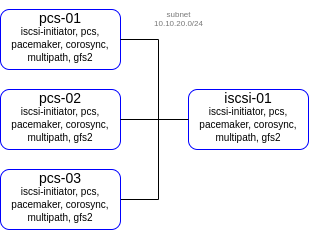

## lab-03
otus | iSCSI, multipath and cluster file systems: GFS2

### Домашнее задание
Реализация GFS2 хранилища на виртуалках под виртуалбокс

#### Цель:
развернуть в VirtualBox следующую конфигурацию с помощью terraform

- виртуалка с iscsi
- 1 виртуалка - Nginx - с публичным IP адресом
- 3 виртуальные машины с разделяемой файловой системой GFS2 поверх cLVM
- должен быть настроен fencing для VirtualBox - https://github.com/ClusterLabs/fence-agents/tree/master/agents/vbox 
  для сдачи
- terraform манифесты
- ansible роль
- README file

#### Критерии оценки:
Статус "Принято" ставится при выполнении перечисленных требований.


### Выполнение домашнего задания

#### Создание стенда

Получаем OAUTH токен:
```
https://cloud.yandex.ru/docs/iam/concepts/authorization/oauth-token
```
Настраиваем аутентификации в консоли:
```
export YC_TOKEN=$(yc iam create-token)
export TF_VAR_yc_token=$YC_TOKEN
```

Создадим директорий lab-03 и перейдём в него:
```
mkdir ./lab-03 && cd ./lab-03/
```
Создадим необходимые файлы. Размещены в репозитории GitHub по ссылке:
```
https://github.com/SergSha/lab-03.git
```

Схема:



Чтобы развернуть стенд, нужно выполнить следующие команды:
```git clone https://github.com/SergSha/lab-03.git && \
cd ./lab-03 && terraform init && terraform apply -auto-approve```
подождав 30 секунд, запустить следующую команду:
```ansible-playbook ./provision.yml```

На всех серверах будут установлены ОС Almalinux 8, настроены смнхронизация времени Chrony, в качестве firewall будет использоваться NFTables.

Сервер iscsi-01 будет служить iSCSI таргетом. В нём будут настроены три типа таргета:
  - fileio,
  - block,
  - ramdisk.

В качестве fileio таргета будет файл /var/iSCSI/file0.IMG размером 1 ГБ.

Для block таргета - отдельно созданный диск /dev/vdb размером 1 ГБ.

А для ramdisk таргета выделим 1 ГБ оперативной памяти, которые могут использоваться другим сервером в качестве swap.

```[root@iscsi-01 ~]# targetcli ls
o- / ..................................................................... [...]
  o- backstores .......................................................... [...]
  | o- block .............................................. [Storage Objects: 1]
  | | o- block0 ....................... [/dev/vdb (1.0GiB) write-thru activated]
  | |   o- alua ............................................... [ALUA Groups: 1]
  | |     o- default_tg_pt_gp ................... [ALUA state: Active/optimized]
  | o- fileio ............................................. [Storage Objects: 1]
  | | o- file0 ............ [/var/iSCSI/file0.IMG (1.0GiB) write-back activated]
  | |   o- alua ............................................... [ALUA Groups: 1]
  | |     o- default_tg_pt_gp ................... [ALUA state: Active/optimized]
  | o- pscsi .............................................. [Storage Objects: 0]
  | o- ramdisk ............................................ [Storage Objects: 1]
  |   o- ram0 ............................................. [(1.0GiB) activated]
  |     o- alua ............................................... [ALUA Groups: 1]
  |       o- default_tg_pt_gp ................... [ALUA state: Active/optimized]
  o- iscsi ........................................................ [Targets: 1]
  | o- iqn.2023-09.local.otus:storage.target00 ....................... [TPGs: 1]
  |   o- tpg1 ........................................... [no-gen-acls, no-auth]
  |     o- acls ...................................................... [ACLs: 3]
  |     | o- iqn.2023-09.local.sergsha:pcs-01 ................. [Mapped LUNs: 3]
  |     | | o- mapped_lun0 ............................ [lun0 fileio/file0 (rw)]
  |     | | o- mapped_lun1 ............................ [lun1 block/block0 (rw)]
  |     | | o- mapped_lun2 ............................ [lun2 ramdisk/ram0 (rw)]
  |     | o- iqn.2023-09.local.sergsha:pcs-02 ................. [Mapped LUNs: 3]
  |     | | o- mapped_lun0 ............................ [lun0 fileio/file0 (rw)]
  |     | | o- mapped_lun1 ............................ [lun1 block/block0 (rw)]
  |     | | o- mapped_lun2 ............................ [lun2 ramdisk/ram0 (rw)]
  |     | o- iqn.2023-09.local.sergsha:pcs-03 ................. [Mapped LUNs: 3]
  |     |   o- mapped_lun0 ............................ [lun0 fileio/file0 (rw)]
  |     |   o- mapped_lun1 ............................ [lun1 block/block0 (rw)]
  |     |   o- mapped_lun2 ............................ [lun2 ramdisk/ram0 (rw)]
  |     o- luns ...................................................... [LUNs: 3]
  |     | o- lun0 ..... [fileio/file0 (/var/iSCSI/file0.IMG) (default_tg_pt_gp)]
  |     | o- lun1 ................. [block/block0 (/dev/vdb) (default_tg_pt_gp)]
  |     | o- lun2 ............................ [ramdisk/ram0 (default_tg_pt_gp)]
  |     o- portals ................................................ [Portals: 1]
  |       o- 0.0.0.0:3260 ................................................. [OK]
  o- loopback ..................................................... [Targets: 0]
[root@iscsi-01 ~]# ```

Для каждого таргета настроены свои LUNы, для каждого сервера настроены свои ACL доступы.


pcs host auth pcs-01.mydomain.test pcs-02.mydomain.test pcs-03.mydomain.test -u hacluster -p strong_pass

pcs cluster setup hacluster pcs-01.mydomain.test pcs-02.mydomain.test pcs-03.mydomain.test

pcs cluster enable --all

pcs cluster start --all


pcs resource create dlm systemd:dlm op monitor interval=10s on-fail=ignore clone interleave=true ordered=true

pcs resource create lvmlockd ocf:heartbeat:lvmlockd op monitor interval=10s on-fail=ignore clone interleave=true ordered=true

pcs constraint order start dlm-clone then lvmlockd-clone


vgcreate --shared block_cluster_vg /dev/mapper/otusBlock

vgchange --lockstart block_cluster_vg

lvcreate --activate sy -l 100%FREE -n block0_cluster_lv block_cluster_vg


mkfs.gfs2 -j3 -p lock_dlm -t hacluster:gfs2-block /dev/mapper/block_cluster_vg/block0_cluster_lv


pcs resource create block_cluster_fs Filesystem device=/dev/block_cluster_vg/block0_cluster_lv directory=/mnt/lvm_cluster_block0 fstype='gfs2' 'options=noatime' op monitor interval=30s on-fail=ignore clone interleave=true


pcs resource create fileio_cluster_vg ocf:heartbeat:LVM-activate lvname=file0_cluster_lv vgname=fileio_cluster_vg activation_mode=shared vg_access_mode=lvmlockd op monitor interval=10s on-fail=ignore clone interleave=true ordered=true

pcs resource create block_cluster_vg ocf:heartbeat:LVM-activate lvname=block0_cluster_lv vgname=block_cluster_vg activation_mode=shared vg_access_mode=lvmlockd op monitor interval=10s on-fail=ignore clone interleave=true ordered=true

pcs constraint order start lvmlockd-clone then fileio_cluster_vg-clone

pcs constraint order start lvmlockd-clone then block_cluster_vg-clone

pcs constraint colocation add fileio_cluster_vg-clone with lvmlockd-clone

pcs constraint colocation add block_cluster_vg-clone with lvmlockd-clone

pcs resource create fileio_cluster_fs ocf:heartbeat:Filesystem device=/dev/fileio_cluster_vg/file0_cluster_lv directory=/mnt/lvm_cluster_file0 fstype=gfs2 options=noatime op monitor interval=10s on-fail=ignore clone interleave=true

pcs resource create block_cluster_fs ocf:heartbeat:Filesystem device=/dev/block_cluster_vg/block0_cluster_lv directory=/mnt/lvm_cluster_block0 fstype=gfs2 options=noatime op monitor interval=10s on-fail=ignore clone interleave=true

pcs constraint order start fileio_cluster_vg-clone then fileio_cluster_fs-clone

pcs constraint order start block_cluster_vg-clone then block_cluster_fs-clone

pcs constraint colocation add fileio_cluster_fs-clone with fileio_cluster_vg-clone

pcs constraint colocation add block_cluster_fs-clone with block_cluster_vg-clone