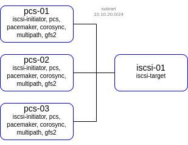

## lab-03
otus | iSCSI, multipath and cluster file systems: GFS2

### Домашнее задание
Реализация GFS2 хранилища на виртуалках под виртуалбокс

#### Цель:
развернуть в VirtualBox следующую конфигурацию с помощью terraform

- виртуалка с iscsi
- 1 виртуалка - Nginx - с публичным IP адресом
- 3 виртуальные машины с разделяемой файловой системой GFS2 поверх cLVM
- должен быть настроен fencing для VirtualBox - https://github.com/ClusterLabs/fence-agents/tree/master/agents/vbox 
  для сдачи
- terraform манифесты
- ansible роль
- README file

#### Критерии оценки:
Статус "Принято" ставится при выполнении перечисленных требований.


### Выполнение домашнего задания

#### Создание стенда

Получаем OAUTH токен:
```
https://cloud.yandex.ru/docs/iam/concepts/authorization/oauth-token
```
Настраиваем аутентификации в консоли:
```
export YC_TOKEN=$(yc iam create-token)
export TF_VAR_yc_token=$YC_TOKEN
```

Создадим директорий lab-01 и перейдём в него:
```
mkdir ./lab-02 && cd ./lab-02/
```
Создадим необходимые файлы. Размещены в репозитории GitHub по ссылке:
```
https://github.com/SergSha/lab-02.git
```

Схема:


```https://www.golinuxcloud.com/setup-high-availability-cluster-centos-8/```


pcs host auth pcs-01.mydomain.test pcs-02.mydomain.test pcs-03.mydomain.test -u hacluster -p strong_pass

pcs cluster setup hacluster pcs-01.mydomain.test pcs-02.mydomain.test pcs-03.mydomain.test

pcs cluster enable --all

pcs cluster start --all


pcs resource create dlm systemd:dlm op monitor interval=10s on-fail=ignore clone interleave=true ordered=true

pcs resource create lvmlockd ocf:heartbeat:lvmlockd op monitor interval=10s on-fail=ignore clone interleave=true ordered=true

pcs constraint order start dlm-clone then lvmlockd-clone


vgcreate --shared block_cluster_vg /dev/mapper/otusBlock

vgchange --lockstart block_cluster_vg

lvcreate --activate sy -l 100%FREE -n block0_cluster_lv block_cluster_vg


mkfs.gfs2 -j3 -p lock_dlm -t hacluster:gfs2-block /dev/mapper/block_cluster_vg/block0_cluster_lv


pcs resource create block_cluster_fs Filesystem device=/dev/block_cluster_vg/block0_cluster_lv directory=/mnt/lvm_cluster_block0 fstype='gfs2' 'options=noatime' op monitor interval=30s on-fail=ignore clone interleave=true


pcs resource create block_cluster_vg ocf:heartbeat:LVM-activate lvname=block0_cluster_lv vgname=block_cluster_vg activation_mode=shared vg_access_mode=lvmlockd op monitor interval=10s on-fail=ignore clone interleave=true ordered=true

pcs constraint order start lvmlockd-clone then block_cluster_vg-clone

pcs constraint colocation add block_cluster_vg-clone with lvmlockd-clone

pcs resource create block_cluster_fs ocf:heartbeat:Filesystem device=/dev/block_cluster_vg/block0_cluster_lv directory=/mnt/lvm_cluster_block0 fstype=gfs2 options=noatime op monitor interval=10s on-fail=ignore clone interleave=true

